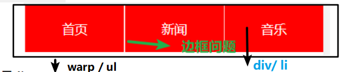
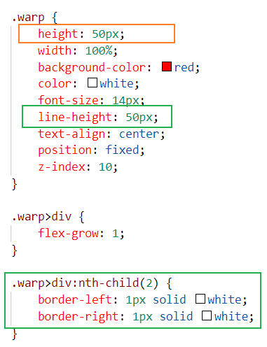
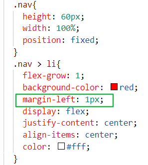

# 问题自查

##### 1.绝对定位失效

手机端布局时：底部导航和顶部搜素框用了绝对定位position = fixed；但是滚轮上下滑动时，绝对定位失效，会跟着伸缩

> 原因 ： 在最外层套了一个大盒子： width：100%；height：100vh，造成的
>
> 解决方法：取消即好


##### 2.span里面套精灵图

//前提：已经用div把span套着了：为了把div改成圆形

> 设置span的大小和精灵图差不多大，插入背景精灵图
>
> 给span设置为display：inline- block  //这样精灵图才会显示出来
>
> 给span设置margin-top细调精灵图的位置
>


##### 3.精灵图尺寸过大

//前提：精灵图中单个图像的尺寸过大

```html
<div> //height:50px; 
    <div class="精灵图"></div>  //height:30px;
    <div>文字</div>  //height:20px; line-height:20px,
</div>
```

>  给装精灵图的小盒子一个宽高，插入背景精灵图
>
>  //此时会发现背景不见了
>
>  //可以给bg一个border，以发现背景位置：精灵图太大了，调大了小盒子的宽度后，终于发现了精灵图
>
>  设置小盒子的backgound-size: xxpx;
>
>  最后调节bg-position：xxpx  xxpx;

##### 4.图片与文字对齐（纵向）

>  //如果图片的宽度和文字宽度不一样，如何实现对齐？？
>
>  给大盒子加flex
>
>  flex-direction: cloumn //图片和字为纵排
>
>  align-itms: center  // 左右隔开（此时左右隔开不是justify-content）
>
>  //也可以把块级元素自动对齐，margin-auto；或者把没对齐的图片块单独设置margin-left

##### 5.移动端设置横向宽度的时候，用rem或者%

##### 6.固定文档行宽度，超出的部分显示为（...）

~~~css
p{border: 1px solid gray; 
width: 100px;
//处理元素中的空白方式为：内容不换行
white-space: nowrap; 
overflow: hidden;
//文本隐藏的时候显示为：...
text-overflow: elipsis;  
~~~

#### 7.清除浮动

清除浮动是一个时常会遇到的问题，不少人的解决办法是添加一个空的 div 应用 clear:both; 属性。现在，无需增加没有意义的元素，仅需要以下样式即可在元素尾部自动清除浮动：

```
.clear-fix { *overflow: hidden; *zoom: 1; }
.clear-fix:after { display: table; content: ""; width: 0; clear: both; }
```

#### 8.引号变大

许多人喜欢给 blockquote 引用段添加巨大的引号作为背景，这种时候我们就可以用 :before 来代替 background 了，即可以给背景留下空间，还可以直接使用文字而非图片：

```css
blockquote::before {
	content: open-quote;
	position: absolute;
	z-index: -1;
	color: #DDD;
	font-size: 120px;
	font-family: serif;
	font-weight: bolder;
}
```

##### 9.去除display: inline-block; 元素之间的空隙

答：

**法1.  删除换行和空格**

`  <ul>`  

`li>xxx</li><li>xxx</li><li>xxx</li><li>xxx</li>`  

`</ul>`  

**法2：设置父级元素ul的` font-size=0;` 再单独设置当前字体的颜色大小**

`ul{`

`font-size=0;`

`}`

` ul>li{` 

`font-size: 16px;`

`display: inline-block;`

`background: gray;`

`color:#fff;//字体颜色（不是font-color）}`

- 想要将元素排列到一行，可以用display：inline-block；但是内联块存在间隙问题，可以选择浮动的方式将元素排列到一行。

##### 10.上下盒子设置margin时的高度塌陷

1. 当有上下两个盒子时

   上边的盒子有下边距 margin-bottom： 20px；

   下边的盒子有上边距 margin-top： 10px ；

=> 两盒子之间的margin取值为边距最大的（margin的合并）  //20px

> ```css
> solve ：
> //只设置上边盒子的下边距
> ```

##### 11.盒子套盒子再套盒子（多层盒子）

1. 块里面嵌套一个块的时候，外边距塌陷

   stp1. 外层块设置margin-top

   stp2. 内部块再设置margin-top没有效果，且当内部margin-top>外层margin-top的时候，两块会一起向下移动，且移动距离为最大的那个margin-top值 （外边距塌陷）

```css
solve this problem

//法1 ：在外层的div设置 overflow ： hidden//如果超出div的宽高，会隐藏

//法2： 给外层的div设置边框： border: 1px solid tranperant;

//法3： 给外层的div设置一个padding ： 1px；

//个人发现： 把出问题的盒子转为行内块好像也能解决

只设置最内层的盒子的宽高，然后设置padding，各级父盒子转为行内块元素（或者浮动、弹性盒子）就行了（宽高由内容撑开），不用设置各级父盒子的宽高
```


##### 12.当在块里面插入图片，但是发现图片掉下来了，不能居中

​	//法1.块转为行内块，再设line-height=height

```css
//法2. <!-- 让图片居中，不能在div中设置 -->
 
```

##### 13.设置行内块内的背景图

```css
background:url(图片路径) no-repeat 95% center;//靠右边且在中间
```


##### 14.chrome浏览器 涉及到鼠标移到边框时 hover改变颜色时，需要先清除浏览器默认的边框样式

```css
outline-style: none;
```


### 15.宽高问题

~~~html
<div id="app">
  <div></div>
  <span>123123</span>
</div>

#app {
width: 500px;
height:200px
}
#app>div => 宽500，高0；div是块级元素，高度由内容撑开，现在没有内容，因此没有宽
#app>span => 行内元素默认宽高由内容宽高决定

//弹性盒子
#app > div {
display:flex;  //子盒子设置弹性
}
#app>div => 宽500，高0；弹性盒子的容器特性

//
<div id="app">
  <div>
    <h3></h3>  => 宽0，高0; 高度默认填满父元素，但是父元素高度为0，宽是内容的宽，没有内容也为0
  </div> 
</div>

//定位元素
绝对定位，固定定位=> 宽高都是由内容撑开的
相对定位 => 宽默认为是父元素的宽，高默认为内容的高
~~~

> 举例1:clown_face:父盒子设置弹性
>
> ~~~css
> <div id="app">
>   <div>
>   <div></div>
>   </div>
> </div>
>
> #app {
> width: 500px;
> height:200px
> display:flex;
> }
> #app>div => 宽0，高200px
> #app>div>div => 宽0，高200px
> ~~~
>
> 举例2：子盒子设置弹性
>
> ~~~css
> <div id="app">
>   <div>
>   <div></div>
>   </div>
> </div>
>
> #app {
> width: 500px;
> height:200px
> }
> #app>div {
>   display: flex;
> }
> #app>div => 宽500px，高0px
> #app>div>div => 宽0，高0px
> ~~~


### 16.居中问题

##### 纯文本

>  水平居中  => text-align:center;
>
>  垂直居中  =>line-height : 元素的高

#####行内元素

> 水平居中 => text-align:center; （需要有父级并在父级中设置，即外层有宽度）
>
> 垂直居中  =>line-height : 元素的高

块级元素

> 水平居中 => margin: 0 auto; (设置样式的元素，在其父元素中居中)
>
> 垂直居中 => 没有直接方法

#### 所有居中，都可以用弹性盒子解决

> display:flex;
>
> juestify-content：center;
>
> align-items : center;
>
> 

###17.弹性盒子边框问题

> 场景，导航栏中间的竖条
>
> 

######解决方法1：中间使用的是div

> 设置第二块div的左右边框即可



######解决方法2：使用列表结构

> 给li设置margin-left



###17.当图片和旁边div设置一样高度时，发现高度不一样

> 是图片底部间隙的问题，将图片设置 => display: block;就能解决

###18.想设置鼠标移入显示的时候，发现display:block 和 display:flex 冲突

> 将要移入显示的弹性盒子外面在包一个盒子=> 对该盒子设置display: block;

###19.绝对定位元素的宽无法继承父元素的

> 手动设置

### 购物车中的全选框（原生dom操作）

> 题目
>
> ~~~css
>  // 点击全选复选框 => 设置所有水果复选框的勾选状态。(全打钩或不勾)
>  // 点击水果复选框 => 判断是不是全打钩了(标志位), 是就给全选复选框打钩，不是，就给全选复选框不打钩。
>  <div id="wrap">
>     <input type="checkbox" />香蕉
>     <input type="checkbox" />西瓜
>     <input type="checkbox" />山竹
>     <input type="checkbox" />苹果
>     <input type="checkbox" />草莓
>   </div>
>   <div id="wrap2">
>     <input type="checkbox" />全选
>   </div>
> ~~~

~~~js
const aInput = document.querySelectAll('#wrap > input');
const oAll = document.querySelectAll('#wrap2 > input');
//设置全选框
oAll.onclick = function () {
    for(let i = 0; i < aInput.length; i++){
        //让每一个水果item根据全选框的状态,切换打钩与否
        aInput[i].checked = oAll.checked;
    }
}
//设置每个item
for(let i = 0; i < aInput.length; i++){
    aInput[i].onclick = function () {
        //多个事件共同影响一个事件 => 设置标志位
        let flag = true;
        //循环比较是否全部打钩
        for(let i = 0; i < aInput.length; i++){
            //如果有一个没有打钩
            if( !aInput[i].checked){
                flag = false;
                break;// => 直接跳出循环,后面的不用比较了
            }
            oAll.checked = flag;
    }
}
~~~

#### dom操作 div里本来就有数字,实现事件 => 数字自加

~~~js
this.innerHTML++;
~~~

##### JS原生: 统计字符串中重复出现的字符的个数

> ~~~js
> const str = 'hasdjfhafdgsasjdfhajshdfjkhagdfhjgadhjfghjadgfhjfgsadhfasahusdgfgsfdagsd';
> 
>  const obj = {};
> 
>     str.split('').forEach(item => {
>       // 有对应的属性则属性值+1，没有就初始化为1
>       if (obj[item]) {
>         obj[item]++
>       } else {
>         obj[item] = 1;
>       }
>     });
> 
>     // 吧对象转换成数组后，排序，把最多次数的字符，排在第一个位置。
>     // const arr = Object.entries(obj).sort((a, b) => b[1] - a[1]);
>     // alert(`出现次数最多的字符是${arr[0][0]},它出现了${arr[0][1]}次`);
> 
>     // 解构赋值。
>     // const [[w, c]] = Object.entries(obj).sort((a, b) => b[1] - a[1]);
>     // alert(`出现次数最多的字符是${w},它出现了${c}次`);
> 
> ~~~
>
> 